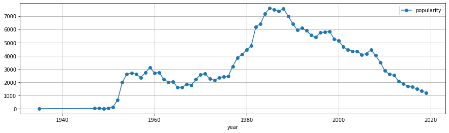
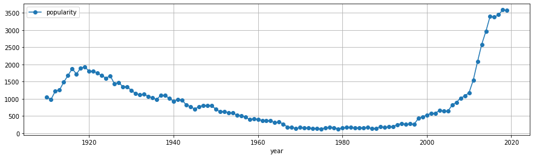
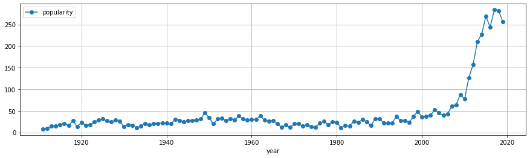
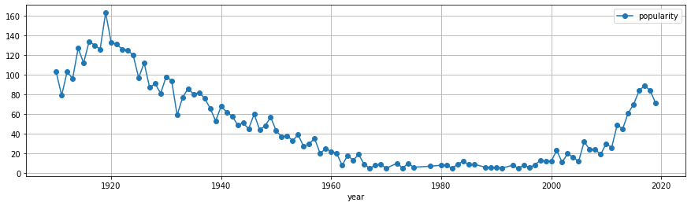

# babe

Note that the first time you import name, you need to have access to the Internet, and it will take a few seconds (depending on bandwidth) to download the required data.

But this data is automatically saved in a local file so things are faster the next time around.

To install:

```pip install graze```

Then in a python console or notebook...

```python
from babe import names_by_us_states, names_all_us_states
```

## names_all_us_state

This data frame provides popularity matrix for names of babies born in the US between 1910 and 2019.


```python
names_all_us_states
```


<div>
<table border="1" class="dataframe">
  <thead>
    <tr style="text-align: right;">
      <th></th>
      <th></th>
      <th>popularity</th>
    </tr>
    <tr>
      <th>name</th>
      <th>year</th>
      <th></th>
    </tr>
  </thead>
  <tbody>
    <tr>
      <th rowspan="2" valign="top">Aaban</th>
      <th>2013</th>
      <td>6</td>
    </tr>
    <tr>
      <th>2014</th>
      <td>6</td>
    </tr>
    <tr>
      <th>Aadam</th>
      <th>2019</th>
      <td>6</td>
    </tr>
    <tr>
      <th rowspan="2" valign="top">Aadan</th>
      <th>2008</th>
      <td>12</td>
    </tr>
    <tr>
      <th>2009</th>
      <td>6</td>
    </tr>
    <tr>
      <th>...</th>
      <th>...</th>
      <td>...</td>
    </tr>
    <tr>
      <th rowspan="3" valign="top">Zyriah</th>
      <th>2013</th>
      <td>7</td>
    </tr>
    <tr>
      <th>2014</th>
      <td>6</td>
    </tr>
    <tr>
      <th>2016</th>
      <td>5</td>
    </tr>
    <tr>
      <th>Zyron</th>
      <th>2015</th>
      <td>5</td>
    </tr>
    <tr>
      <th>Zyshonne</th>
      <th>1998</th>
      <td>5</td>
    </tr>
  </tbody>
</table>
<p>594681 rows × 1 columns</p>
</div>


```python
names = set(names_all_us_states.reset_index()['name'].values)
print(f"{len(names)} unique names")
```

    31862 unique names


```python
years = set(names_all_us_states.reset_index()['year'])
print(f"Popularity stats cover years {min(years)} through {max(years)} (or subset thereof, depending on the name)")
```

    Popularity stats cover years 1910 through 2019 (or subset thereof, depending on the name)


```python
names_all_us_states.loc['Vanessa'].plot(figsize=(15, 4), style='-o', grid=True)
```


    

    


```python
names_all_us_states.loc['Cora'].plot(figsize=(15, 4), style='-o', grid=True)
```


    

    


## names_by_us_states

This dataframe provides the same as above, but by state. 51 US states are covered.


```python
names_by_us_states
```


<div>
<table border="1" class="dataframe">
  <thead>
    <tr style="text-align: right;">
      <th></th>
      <th></th>
      <th></th>
      <th>gender</th>
      <th>popularity</th>
    </tr>
    <tr>
      <th>state</th>
      <th>name</th>
      <th>year</th>
      <th></th>
      <th></th>
    </tr>
  </thead>
  <tbody>
    <tr>
      <th rowspan="5" valign="top">AK</th>
      <th>Mary</th>
      <th>1910</th>
      <td>F</td>
      <td>14</td>
    </tr>
    <tr>
      <th>Annie</th>
      <th>1910</th>
      <td>F</td>
      <td>12</td>
    </tr>
    <tr>
      <th>Anna</th>
      <th>1910</th>
      <td>F</td>
      <td>10</td>
    </tr>
    <tr>
      <th>Margaret</th>
      <th>1910</th>
      <td>F</td>
      <td>8</td>
    </tr>
    <tr>
      <th>Helen</th>
      <th>1910</th>
      <td>F</td>
      <td>7</td>
    </tr>
    <tr>
      <th>...</th>
      <th>...</th>
      <th>...</th>
      <td>...</td>
      <td>...</td>
    </tr>
    <tr>
      <th rowspan="5" valign="top">WY</th>
      <th>Theo</th>
      <th>2019</th>
      <td>M</td>
      <td>5</td>
    </tr>
    <tr>
      <th>Tristan</th>
      <th>2019</th>
      <td>M</td>
      <td>5</td>
    </tr>
    <tr>
      <th>Vincent</th>
      <th>2019</th>
      <td>M</td>
      <td>5</td>
    </tr>
    <tr>
      <th>Warren</th>
      <th>2019</th>
      <td>M</td>
      <td>5</td>
    </tr>
    <tr>
      <th>Waylon</th>
      <th>2019</th>
      <td>M</td>
      <td>5</td>
    </tr>
  </tbody>
</table>
<p>6122890 rows × 2 columns</p>
</div>


```python
states = set(names_by_us_states.reset_index()['state'])
print(f"{len(states)} states")
```

    51 states


```python
names_by_us_states.loc['CA']
```


<div>
<table border="1" class="dataframe">
  <thead>
    <tr style="text-align: right;">
      <th></th>
      <th></th>
      <th>gender</th>
      <th>popularity</th>
    </tr>
    <tr>
      <th>name</th>
      <th>year</th>
      <th></th>
      <th></th>
    </tr>
  </thead>
  <tbody>
    <tr>
      <th>Mary</th>
      <th>1910</th>
      <td>F</td>
      <td>295</td>
    </tr>
    <tr>
      <th>Helen</th>
      <th>1910</th>
      <td>F</td>
      <td>239</td>
    </tr>
    <tr>
      <th>Dorothy</th>
      <th>1910</th>
      <td>F</td>
      <td>220</td>
    </tr>
    <tr>
      <th>Margaret</th>
      <th>1910</th>
      <td>F</td>
      <td>163</td>
    </tr>
    <tr>
      <th>Frances</th>
      <th>1910</th>
      <td>F</td>
      <td>134</td>
    </tr>
    <tr>
      <th>...</th>
      <th>...</th>
      <td>...</td>
      <td>...</td>
    </tr>
    <tr>
      <th>Zayvion</th>
      <th>2019</th>
      <td>M</td>
      <td>5</td>
    </tr>
    <tr>
      <th>Zeek</th>
      <th>2019</th>
      <td>M</td>
      <td>5</td>
    </tr>
    <tr>
      <th>Zhaire</th>
      <th>2019</th>
      <td>M</td>
      <td>5</td>
    </tr>
    <tr>
      <th>Zian</th>
      <th>2019</th>
      <td>M</td>
      <td>5</td>
    </tr>
    <tr>
      <th>Ziyad</th>
      <th>2019</th>
      <td>M</td>
      <td>5</td>
    </tr>
  </tbody>
</table>
<p>387781 rows × 2 columns</p>
</div>


```python
names_by_us_states.loc['CA'].loc['Cora']
```


<div>
<table border="1" class="dataframe">
  <thead>
    <tr style="text-align: right;">
      <th></th>
      <th>gender</th>
      <th>popularity</th>
    </tr>
    <tr>
      <th>year</th>
      <th></th>
      <th></th>
    </tr>
  </thead>
  <tbody>
    <tr>
      <th>1911</th>
      <td>F</td>
      <td>8</td>
    </tr>
    <tr>
      <th>1912</th>
      <td>F</td>
      <td>9</td>
    </tr>
    <tr>
      <th>1913</th>
      <td>F</td>
      <td>15</td>
    </tr>
    <tr>
      <th>1914</th>
      <td>F</td>
      <td>15</td>
    </tr>
    <tr>
      <th>1915</th>
      <td>F</td>
      <td>17</td>
    </tr>
    <tr>
      <th>...</th>
      <td>...</td>
      <td>...</td>
    </tr>
    <tr>
      <th>2015</th>
      <td>F</td>
      <td>269</td>
    </tr>
    <tr>
      <th>2016</th>
      <td>F</td>
      <td>244</td>
    </tr>
    <tr>
      <th>2017</th>
      <td>F</td>
      <td>284</td>
    </tr>
    <tr>
      <th>2018</th>
      <td>F</td>
      <td>282</td>
    </tr>
    <tr>
      <th>2019</th>
      <td>F</td>
      <td>256</td>
    </tr>
  </tbody>
</table>
<p>109 rows × 2 columns</p>
</div>


```python
names_by_us_states.loc['CA'].loc['Cora'].plot(figsize=(15, 4), style='-o', grid=True)
```


    

    


```python
names_by_us_states.loc['GA'].loc['Cora'].plot(figsize=(15, 4), style='-o', grid=True)
```


    

    

