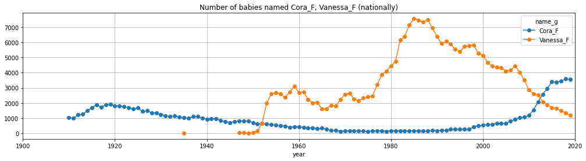

# babe

Note that the first time you import name, you need to have access to the Internet, and it will take a few seconds (depending on bandwidth) to download the required data.

But this data is automatically saved in a local file so things are faster the next time around.

To install:

```pip install babe```

Then in a python console or notebook...


```python
from babe import UsNames

d = UsNames()
```

# Intro to the data

The fundamental data provides a popularity score (number of babies recorded) associated to a `(state, gender, name, year)` tuple (that has data -- for names of babies born in the US between 1910 and 2019).


```python
d.data
```


<table border="1" class="dataframe">
  <thead>
    <tr style="text-align: right;">
      <th></th>
      <th>state</th>
      <th>gender</th>
      <th>year</th>
      <th>name</th>
      <th>popularity</th>
      <th>name_g</th>
    </tr>
  </thead>
  <tbody>
    <tr>
      <th>0</th>
      <td>AK</td>
      <td>F</td>
      <td>1910</td>
      <td>Mary</td>
      <td>14</td>
      <td>Mary_F</td>
    </tr>
    <tr>
      <th>1</th>
      <td>AK</td>
      <td>F</td>
      <td>1910</td>
      <td>Annie</td>
      <td>12</td>
      <td>Annie_F</td>
    </tr>
    <tr>
      <th>2</th>
      <td>AK</td>
      <td>F</td>
      <td>1910</td>
      <td>Anna</td>
      <td>10</td>
      <td>Anna_F</td>
    </tr>
    <tr>
      <th>3</th>
      <td>AK</td>
      <td>F</td>
      <td>1910</td>
      <td>Margaret</td>
      <td>8</td>
      <td>Margaret_F</td>
    </tr>
    <tr>
      <th>4</th>
      <td>AK</td>
      <td>F</td>
      <td>1910</td>
      <td>Helen</td>
      <td>7</td>
      <td>Helen_F</td>
    </tr>
    <tr>
      <th>...</th>
      <td>...</td>
      <td>...</td>
      <td>...</td>
      <td>...</td>
      <td>...</td>
      <td>...</td>
    </tr>
    <tr>
      <th>28277</th>
      <td>WY</td>
      <td>M</td>
      <td>2019</td>
      <td>Theo</td>
      <td>5</td>
      <td>Theo_M</td>
    </tr>
    <tr>
      <th>28278</th>
      <td>WY</td>
      <td>M</td>
      <td>2019</td>
      <td>Tristan</td>
      <td>5</td>
      <td>Tristan_M</td>
    </tr>
    <tr>
      <th>28279</th>
      <td>WY</td>
      <td>M</td>
      <td>2019</td>
      <td>Vincent</td>
      <td>5</td>
      <td>Vincent_M</td>
    </tr>
    <tr>
      <th>28280</th>
      <td>WY</td>
      <td>M</td>
      <td>2019</td>
      <td>Warren</td>
      <td>5</td>
      <td>Warren_M</td>
    </tr>
    <tr>
      <th>28281</th>
      <td>WY</td>
      <td>M</td>
      <td>2019</td>
      <td>Waylon</td>
      <td>5</td>
      <td>Waylon_M</td>
    </tr>
  </tbody>
</table>
<p>6122890 rows × 6 columns</p>
</div>


```python
print(f"{len(d.names)} unique names")
```

    31862 unique names


But some names can be used for both genders, so most of the internals will use `name_g`, the name concatenated with the gender (`_F` or `_M`):


```python
print(f"{len(d.name_gs)} unique names_g (gendered names)")
```

    34952 unique names_g (gendered names)


You can use `resolve_name_g` to get the `name_g` corresponding to a name as long as the name isn't used for more than one gender.


```python
d.resolve_name_g('Cora')
```


    'Cora_F'


```python
try:
    d.resolve_name_g('Vanessa')
except AssertionError as e:
    print(e)
```

    The Vanessa can be used for both genders. Specify Vanessa_F or Vanessa_M


## by_state data

In some cases, it's more convenient to have a view indexed by `(state, name_g, year)`. 
The `by_state` attribute provides that.


```python
d.by_state
```


    state  name_g      year
    AK     Mary_F      1910    14
           Annie_F     1910    12
           Anna_F      1910    10
           Margaret_F  1910     8
           Helen_F     1910     7
                               ..
    WY     Theo_M      2019     5
           Tristan_M   2019     5
           Vincent_M   2019     5
           Warren_M    2019     5
           Waylon_M    2019     5
    Name: popularity, Length: 6122890, dtype: int64


This allows one to do things like getting the data for a given state only:


```python
d.by_state['CA']
```


    name_g      year
    Mary_F      1910    295
    Helen_F     1910    239
    Dorothy_F   1910    220
    Margaret_F  1910    163
    Frances_F   1910    134
                       ... 
    Zayvion_M   2019      5
    Zeek_M      2019      5
    Zhaire_M    2019      5
    Zian_M      2019      5
    Ziyad_M     2019      5
    Name: popularity, Length: 387781, dtype: int64


... within a state, getting the 'by year popularity' for a given name:


```python
d.by_state['CA']['Cora_F']  # or d.by_state['CA', 'Cora_F']
```


    year
    1911      8
    1912      9
    1913     15
    1914     15
    1915     17
           ... 
    2015    269
    2016    244
    2017    284
    2018    282
    2019    256
    Name: popularity, Length: 109, dtype: int64


... if you wanted to get the data for a given name (really `name_g`), for all states, you can do it using "slicing". 

For example, if you're wondering how many little boys were called "Vanessa", and more specifically, when and where?...


```python
d.by_state[:, 'Vanessa_M'] 
```


    state  year
    AZ     1988     8
    CA     1980     7
           1981     5
           1982    20
           1983    19
           1984    14
           1985    12
           1986    13
           1987    13
           1988    26
           1989    17
           1990    16
           1991    18
           1992    17
           1993    17
           1994    10
           1995     9
           1996    10
           1997    11
           1998     7
    DC     1989    11
    NY     1982     5
           1983     9
           1986     6
           1988     6
           1989     6
    TX     1981     5
           1982     7
           1983    12
           1984     9
           1985    10
           1986     8
           1987     9
           1988     8
           1989     5
           1990     6
           1991     5
           1992     5
           1994     5
    Name: popularity, dtype: int64


## national data

A national aggregation is available through the `national` attribute


```python
d.national
```


    name_g      year
    Aaban_M     2013     6
                2014     6
    Aadam_M     2019     6
    Aadan_M     2008    12
                2009     6
                        ..
    Zyriah_F    2013     7
                2014     6
                2016     5
    Zyron_M     2015     5
    Zyshonne_M  1998     5
    Name: popularity, Length: 633239, dtype: int64


The interface is as with the `by_state` attribute, but without the state specification.


```python
d.national.loc['Vanessa_F']
```


    year
    1935       5
    1947      24
    1948      32
    1949      16
    1950      41
            ... 
    2015    1687
    2016    1633
    2017    1486
    2018    1345
    2019    1188
    Name: popularity, Length: 74, dtype: int64


# Plotting stuff


```python
d.plot_popularity('Cora');
```


    

    


```python
d.plot_popularity('Cora', 'GA');
```


    

    


```python
d.plot_popularity(['Cora', 'Vanessa_F']);
```


    

    


```python
d.plot_popularity('Cora', ['CA', 'GA']);
```


    

    


```python
d.plot_popularity(['Cora', 'Vanessa_F'], ['CA', 'GA']);
```


    

    


# Misc

## gender-ambiguous names

We'll call the "femininity" of a name be the proportion of times it was used (all states, all time) to name a girl, 
and the "masculinity" of a name be defined accordingly. 


```python
d.femininity_of_name.iloc[12000:12010]
```


    Lemmie      0.161290
    Kashmere    0.161290
    Clary       0.162162
    Sung        0.162393
    Kyrie       0.163527
    Cedar       0.163686
    Masyn       0.163895
    Naveen      0.165605
    Chai        0.166667
    Atlee       0.167382
    dtype: float64


```python
d.femininity_of_name.plot(figsize=(17, 5), ylabel='femininity');
```


    

    


```python
d.masculinity_of_name.iloc[19000:19010]
```


    Berkley     0.108889
    Dasani      0.110092
    Sharone     0.111111
    Ifeoluwa    0.111111
    Rama        0.111111
    Scout       0.111486
    Brownie     0.111732
    Lashon      0.113158
    Indigo      0.113364
    Argie       0.113636
    dtype: float64


```python
d.masculinity_of_name.plot(figsize=(17, 5), ylabel='masculinity');
```


    

    


The (gender-)"ambiguity" of a name can thus be defined as twice the minimum of it's femininity and masculinity. 

By defining the ambiguity thusly, we have a score that is between 0 and 1. It is maximal (1) when an equal proportion of boys and girls were named with the name. It is minimal (0) when only one gender was named with it.

Note that this score is raw (or "un-smoothed"). It's computed with the raw counts, so the extreme scores will usually be for names with very low counts. 


```python
d.ambiguity_of_name
```


    Munachiso    1.0
    Addis        1.0
    Deshone      1.0
    Gal          1.0
    Rajdeep      1.0
                ... 
    Sharelle     0.0
    Analy        0.0
    Sharayah     0.0
    Sharaya      0.0
    Aaban        0.0
    Length: 31862, dtype: float64


```python
t = d.ambiguity_of_name
print(f"There are {len(t[t > 0])} (gender-)ambiguous names")
```

    There are 3090 (gender-)ambiguous names


```python
t = d.ambiguity_of_name
t[t > 0].plot(figsize=(17, 5), ylabel='gender-ambiguity');
```


    

    


```python
t = list(d.ambiguous_names)
print(f"{len(t)} (gender-)ambiguous names:")
print(*t[:9], '...', sep=', ')
```

    3090 (gender-)ambiguous names:
    Nolie, Tyrese, Linn, Savannah, Bryn, Rei, Abby, Shilo, Tracy, ...


```python

```
